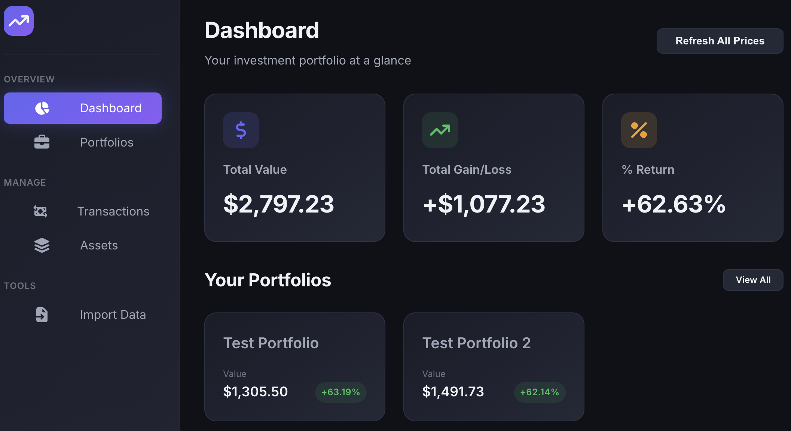
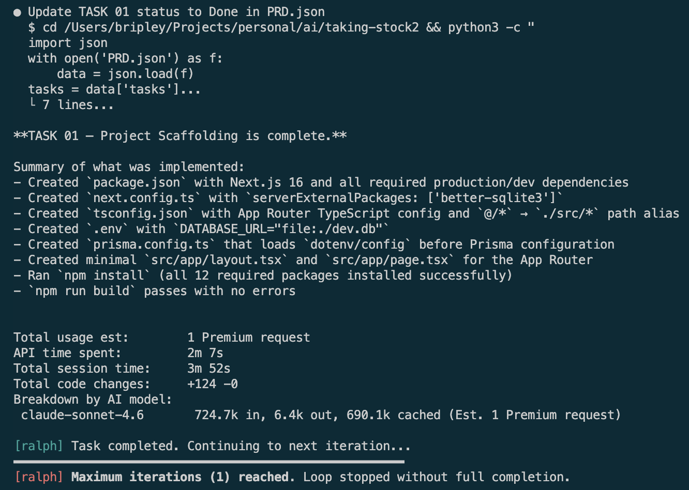

# Ralph Loop Example Project

This repository is a **minimal, AI‑first project skeleton** designed to demonstrate a **[Ralph Loop](https://ghuntley.com/ralph/)**: an autonomous development workflow where an AI assistant can plan, execute, and track delivery by continuously reading and updating a living PRD. Each time the loop executes, the process begins with a fresh context window.

Illustrating this required something more complicated than a simple "To Do" app. I have created a sample Product Requirements Document for an investment portfolio tracker written in Next.js, React, TypeScript, SQLite, and Prisma. The app queries the Yahoo Finance API for quote prices and supports, tracking multiple portfolios, and importing transactions via csv.

The generated project output is not deterministic, but running this produced a working client/server application with a database in less than an hour and consumed only 23 premium requests (Claude Sonnet 4.6).



**Starting state:** this project begins with **only**:
- `PRD.json` — the Product Requirements Document (source of truth)
- `PROMPT.md` — the operating instructions for the AI assistant
- `ralph.sh` - the bash script that calls the loop

The AI development assistant can then run autonomously by:

1) reading `PROMPT.md` for behavioral/operational constraints,
2) reading `PRD.json` for goals and acceptance criteria,
3) creating/iterating the codebase,
4) updating progress back into `PRD.json`.

> [!NOTE]
> This is just an example. Here, the `PRD.json` a local file describing the requirements, but you could easily modify this to use Jira issues or GitHub issues for the same purpose.
>
> You could also update so that each task is implemented on it's own feature branch and merged after verification. This would allow independent features to be developed in parallel.

---

## What is a “Ralph Loop”?

A **Ralph Loop** is an iterative, self-correcting cycle:

1. **Read** the current product intent (`PRD.json`) and operating rules (`PROMPT.md`).
2. **Plan** the next smallest shippable increment.
3. **Execute** the plan (generate code, tests, docs).
4. **Verify** against acceptance criteria.
5. **Record** progress and decisions back into `PRD.json`.
6. **Repeat** until the PRD is complete.

This repo provides conventions and structure so an AI assistant can operate with minimal human intervention.

---

## How to Use This Repo

### 1) Start with the initial three files

- A **clear, testable** `PRD.json`.
- Define the AI assistant’s working agreement in `PROMPT.md`.
- the `ralph.sh` script that will run the loop

This `README.md` is optional at the very beginning, but included here as a guide for humans and as an orientation document for the assistant.

### 2) Ensure the ralph.sh script is executable
```
chmod +x ralph.sh
```

### 3) Test with a single execution
Running once as a sanity check ensures that you haven't forgotten anything before you let this run all night and come back dissapointed. ;) 
```
./ralph.sh 1
```



### 3) Run multiple iterations
Let 'er rip...
```
./ralph.sh
```

### 4) Run the AI assistant autonomously


---

## PROMPT.md Contract Recommended Content

Your `PROMPT.md` should specify **how** the assistant works. Recommended topics:

- **Role & boundaries** (what it can/can’t do)
- **Definition of done** (acceptance criteria)
- **How to update PRD.json** (where to write progress, what to never overwrite)
- **Quality bar** (tests required, linting, formatting)
- **Commit / PR discipline** (if applicable)
- **Safety constraints** (secrets handling, dependency policies)
- **Autonomy rules** (when to ask questions vs decide)

---

## Autonomous Workflow Rules (for assistants)

If you are the AI assistant operating this repo:

1. **Always read** `PROMPT.md` and `PRD.json` before acting.
2. **Never silently change requirements.** If you infer missing requirements, write them to **Open Questions**.
3. **Work in small increments** (ideally 30–90 minutes of effort per loop).
4. **After each loop**, update `PRD.json`:
   - milestone checkbox status
   - what changed (short)
   - what was verified (tests, commands)
   - new risks / decisions
5. **Prefer verification over assertion:** add tests, run linters, document commands.
6. **Stop conditions:** all acceptance criteria satisfied and verified.

---

## Tips for Writing a Strong PRD for Autonomous Execution

- Write **observable acceptance criteria** (inputs → outputs, or measurable behavior).
- Add **constraints** (language/framework choices, deployment target).
- Provide **sample data** and **edge cases**.
- Include a **test strategy** section if quality matters (it usually does).

---

